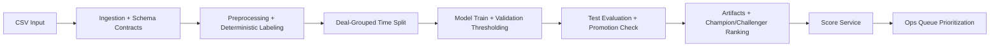

# Recon Break Risk: Architecture Overview

This document summarizes system architecture, process flow, governance, and operating model.

---

## 1. Problem Statement

Financial recon breaks are numerous; only a subset become material/high-risk.  
Goal: rank breaks at raise time so operations review highest-risk breaks first.

---

## 2. Business Scope

- Unit of prediction: one break row
- Prediction time: when break is raised
- Objective: precision-first triage under fixed review capacity (top-k policy)
- User personas:
  - Ops: score-only consumption
  - DS/Admin: training, comparison, promotion decisions

---

## 3. High-Level Architecture

Core modules:
- `src/recon_risk/ingestion.py`
- `src/recon_risk/preprocess.py`
- `src/recon_risk/splitter.py`
- `src/recon_risk/modeling.py`
- `src/recon_risk/pipeline.py`
- `src/recon_risk/artifacts.py`
- `src/recon_risk/service.py`
- `apps/api_app.py`
- `apps/streamlit_app.py`

---

## 4. Data and Label Design

### Input Contract

Hard-required fields for scoring:
- `deal_id`, `deal_type`, `template`, `team`, `break_field`
- `trade_date`, `raised_on`, `review_due`, `query_comments`

Training additionally needs:
- `resolution_via` (for deterministic target mapping)

### Deterministic Labeling

- High-risk resolutions -> `y=1`
- Low-risk resolutions -> `y=0`
- Others -> unknown (excluded from supervised train/eval)

Leakage controls:
- No `resolution_*` fields used as prediction features
- Time-aware grouped split by `deal_id`

---

## 5. Feature Pipeline

Feature families:
- Categorical: context + ops routing fields
- Numeric: age/SLA/mismatch counts
- Text: `query_comments` -> TF-IDF

Model pipeline:
- ColumnTransformer (numeric + categorical + text)
- Classifier selectable: logistic / XGBoost / random forest

---

## 6. Training and Promotion Logic

### Split Strategy

- 70/15/15 by deal group and chronology
- Prevents leakage from same deal across splits

### Thresholding

- Threshold selected on validation set by top-k fraction (default 10%)
- Same threshold applied to test and production scoring

### Promotion Policy

- Primary KPI: `precision_at_top_k`
- Guardrail: `recall_at_top_k >= 0.20`
- Auto-ranking output: `artifacts/model_comparison.json`

---

## 7. Runtime Modes

### Admin / DS Mode

- UI: train + score + run summary
- Used for experimentation and champion selection

### Ops Mode

- UI: score-only
- Locked to champion model

### API Mode

- FastAPI endpoints:
  - `GET /health`
  - `POST /v1/score`
  - `POST /v1/score_csv`
- For service-to-service integration

---

## 8. Artifacts and Governance

Per-model artifacts (`artifacts/<model_name>/`):
- `risk_model.pkl`
- `threshold.json`
- `metrics.json`
- `baseline_config.json`
- `run_metadata.json`

Global artifact:
- `artifacts/model_comparison.json` (champion/challenger ranking)

Observability:
- `logs/recon_risk.log`

---

## 9. Deployment Architecture

Containerized API:
- `Dockerfile.api`
- `.dockerignore`

Environment-driven runtime:
- `CHAMPION_MODEL_NAME`
- `MODEL_ROOT`
- `API_PORT`, `API_HOST`

Deployment targets:
- Render
- Railway
- Fly.io

---

## 10. Risks and Controls

- Data quality drift -> contract validation + preprocessing defaults
- Label ambiguity -> deterministic mapping + unknown class exclusion
- Overfitting -> grouped chronological split + challenger comparisons
- Ops overload -> top-k threshold policy

---

## 11. Current State and Next Steps

Current:
- End-to-end train/eval/score implemented
- Champion/challenger workflow in place
- API and UI both available

Next:
- API auth/token
- CI smoke tests for `/health` and `/v1/score`
- Monitoring and drift alerts
- Explainability layer (SHAP or equivalent)
