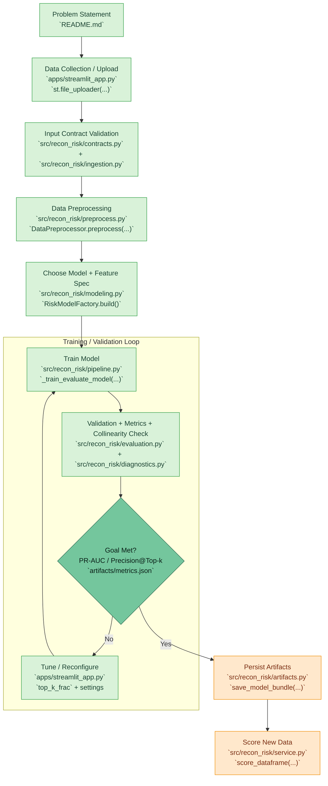
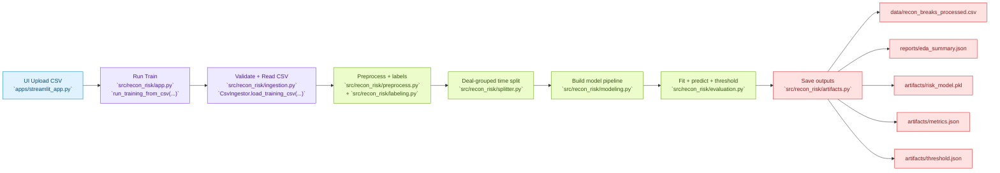
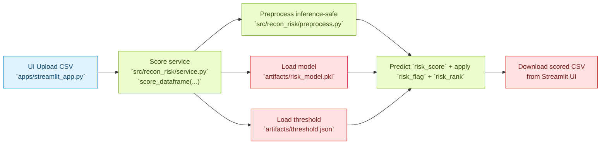

# Recon Risk Pipeline Map

---

## Quick Legend

- `UI`: user interaction
- `Orchestration`: run control
- `Core`: preprocessing/model/evaluation
- `Output`: saved artifacts

---

## Train Path (End-to-End)

---

## Score Path (Using Saved Model)

---

## Step Cards (Minimal)

| Step | What happens | File |
|---|---|---|
| 1 | CSV upload and schema check | [`apps/streamlit_app.py`](../apps/streamlit_app.py) |
| 2 | Build pipeline and run orchestration | [`src/recon_risk/app.py`](../src/recon_risk/app.py) |
| 3 | Validate input contract and load CSV | [`src/recon_risk/contracts.py`](../src/recon_risk/contracts.py), [`src/recon_risk/ingestion.py`](../src/recon_risk/ingestion.py) |
| 4 | Preprocess + deterministic labels | [`src/recon_risk/preprocess.py`](../src/recon_risk/preprocess.py), [`src/recon_risk/labeling.py`](../src/recon_risk/labeling.py) |
| 5 | Grouped chronological split (`deal_id`) | [`src/recon_risk/splitter.py`](../src/recon_risk/splitter.py) |
| 6 | Build + fit Logistic Regression pipeline | [`src/recon_risk/modeling.py`](../src/recon_risk/modeling.py) |
| 7 | Select top-k threshold and compute metrics | [`src/recon_risk/evaluation.py`](../src/recon_risk/evaluation.py) |
| 7b | Run numeric collinearity diagnostics (corr + VIF-style) | [`src/recon_risk/diagnostics.py`](../src/recon_risk/diagnostics.py) |
| 8 | Save model/report artifacts and run metadata | [`src/recon_risk/artifacts.py`](../src/recon_risk/artifacts.py), [`src/recon_risk/pipeline.py`](../src/recon_risk/pipeline.py) |
| 9 | Score new CSV using saved artifacts | [`src/recon_risk/service.py`](../src/recon_risk/service.py) |

---

## Quick File Links

- UI: [`apps/streamlit_app.py`](../apps/streamlit_app.py)
- App entry: [`src/recon_risk/app.py`](../src/recon_risk/app.py)
- Contracts: [`src/recon_risk/contracts.py`](../src/recon_risk/contracts.py)
- Ingestion: [`src/recon_risk/ingestion.py`](../src/recon_risk/ingestion.py)
- Pipeline orchestration: [`src/recon_risk/pipeline.py`](../src/recon_risk/pipeline.py)
- Preprocessing: [`src/recon_risk/preprocess.py`](../src/recon_risk/preprocess.py)
- Label mapping: [`src/recon_risk/labeling.py`](../src/recon_risk/labeling.py)
- Split logic: [`src/recon_risk/splitter.py`](../src/recon_risk/splitter.py)
- Model factory: [`src/recon_risk/modeling.py`](../src/recon_risk/modeling.py)
- Evaluation: [`src/recon_risk/evaluation.py`](../src/recon_risk/evaluation.py)
- Logging: [`src/recon_risk/logging_utils.py`](../src/recon_risk/logging_utils.py)
- Artifact writing: [`src/recon_risk/artifacts.py`](../src/recon_risk/artifacts.py)
- Scoring service: [`src/recon_risk/service.py`](../src/recon_risk/service.py)
